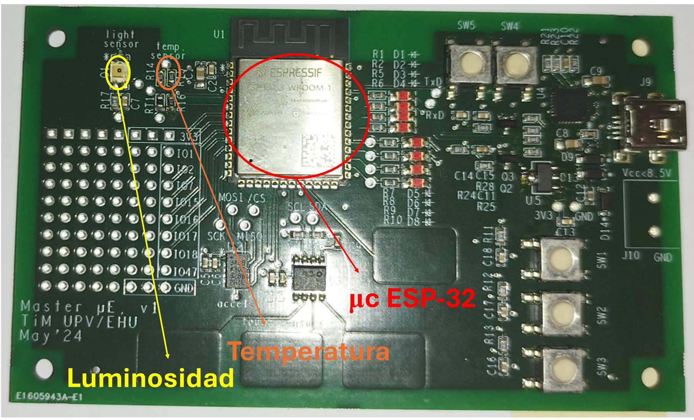
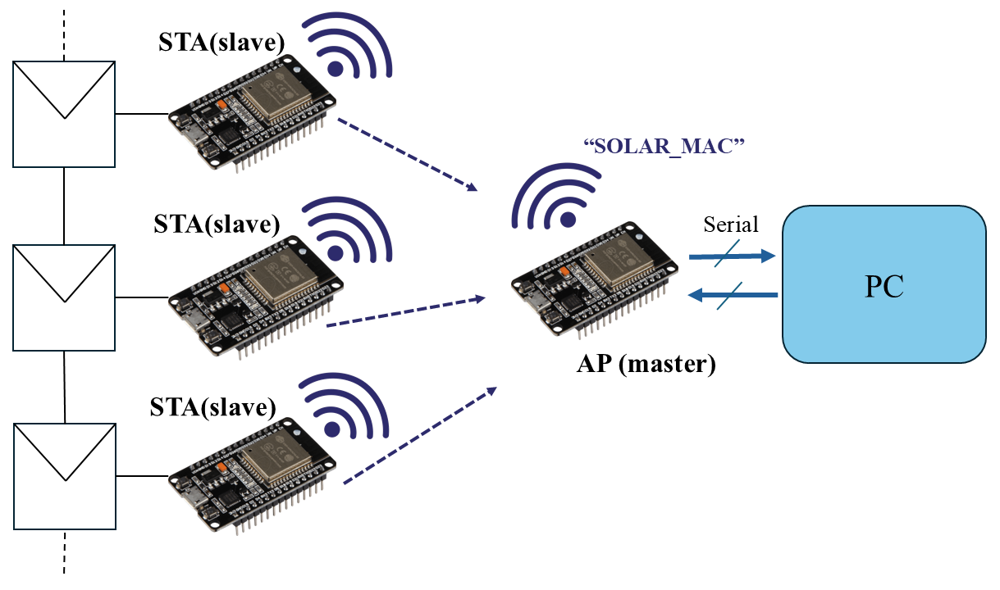
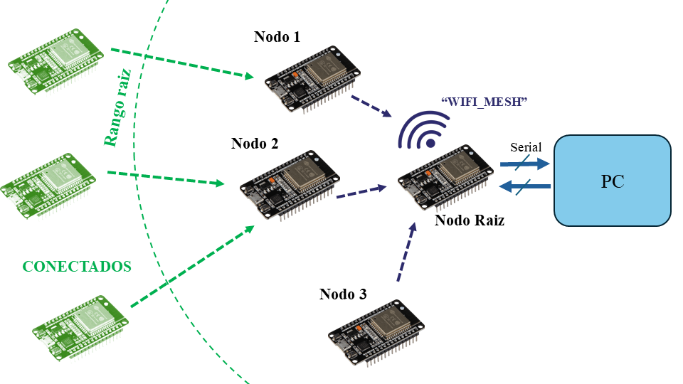
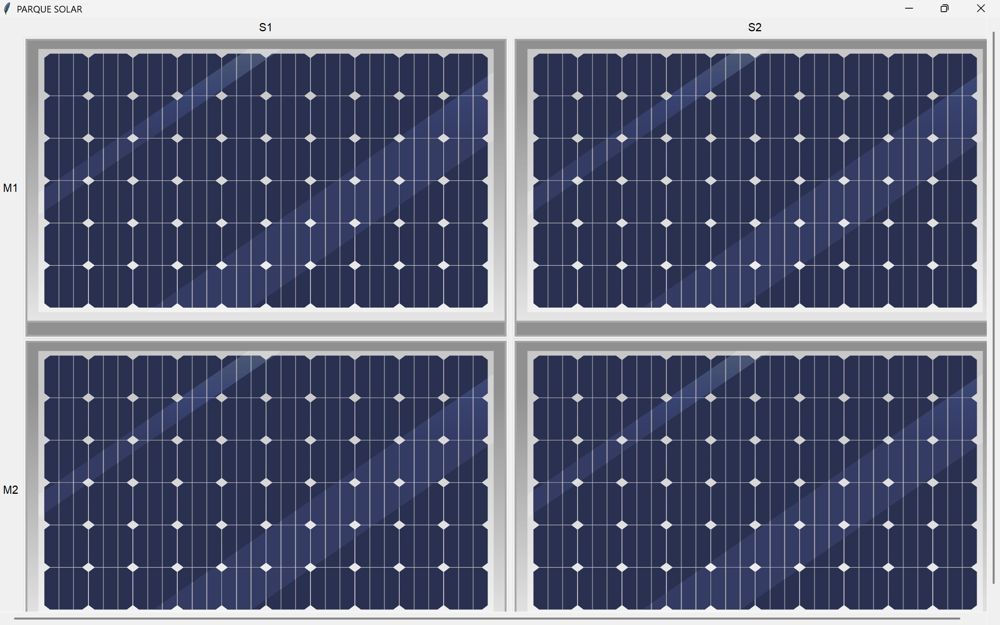
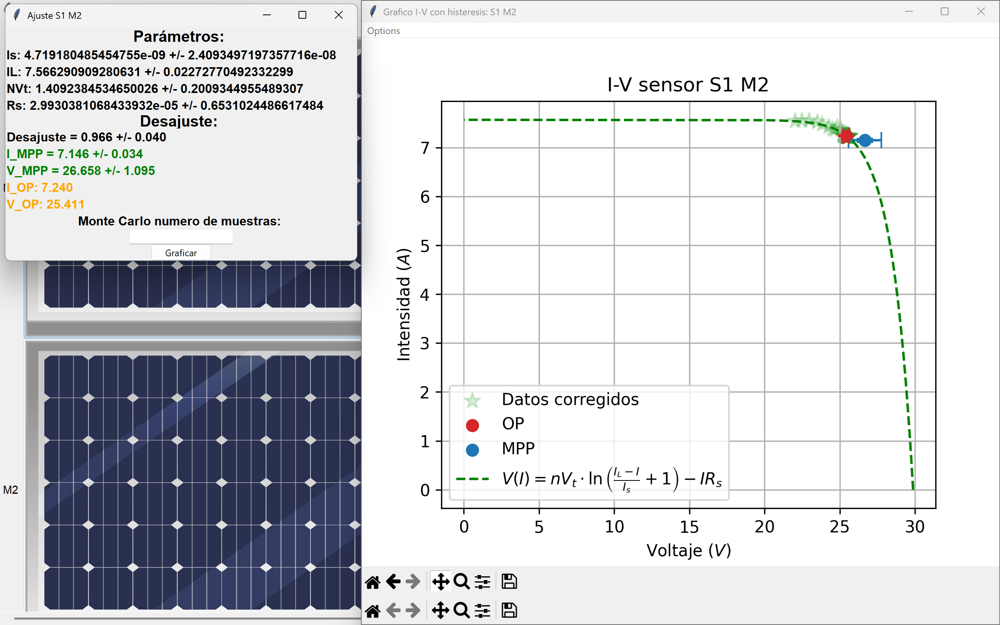
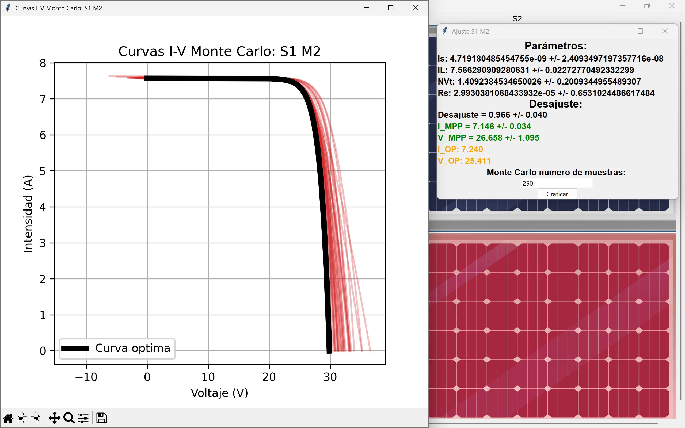
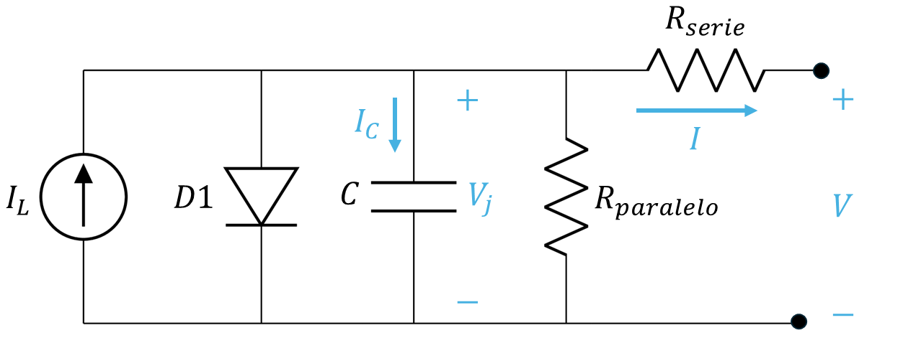
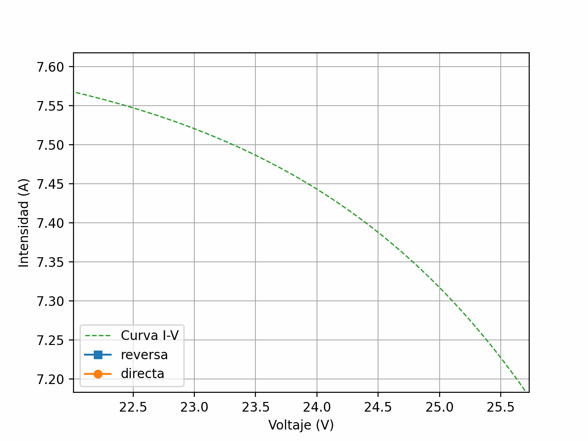
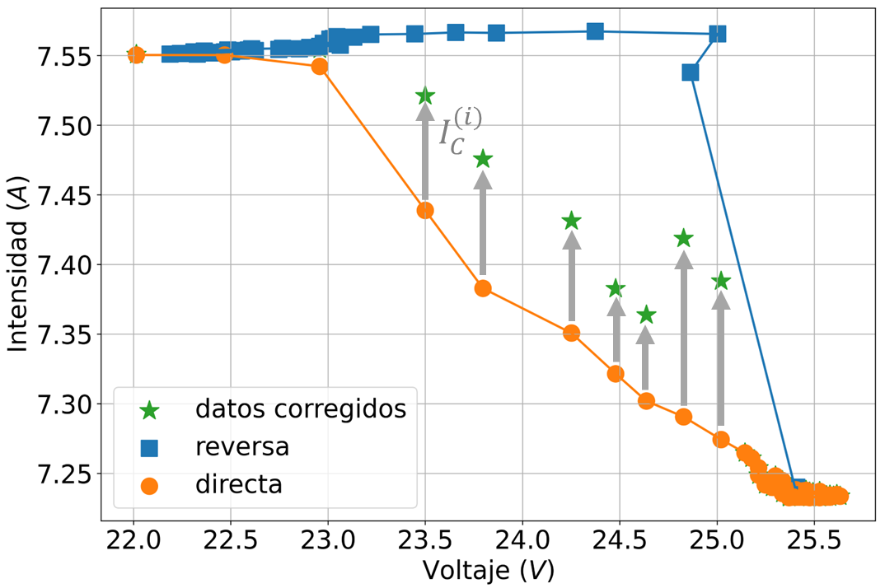
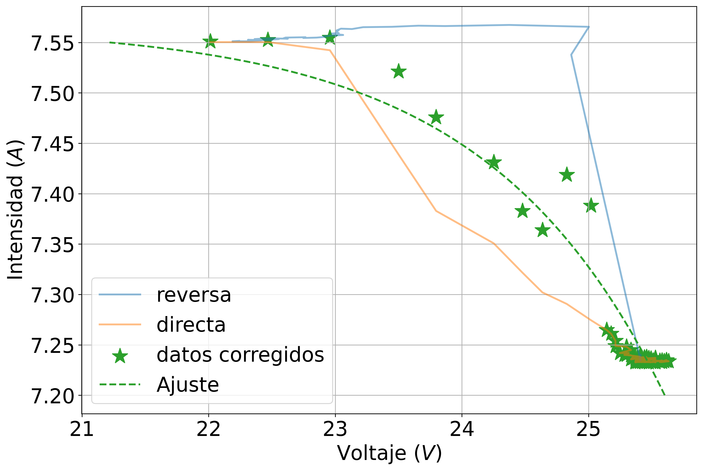

# TFG-ESP32
En este repositorio se encuentran los programas Arduino IDE para el proyecto TFG de Ingeniería electrónica basado en programación del microcontrolador *ESP32*. También se encuentran los archivos Python para las diferentes interfaces.

## Objetivo
El repositorio contiene el código necesario para la creación de un software de control de red de sensores inalámbricas para la monitorización de sistemas fotovoltaicos.

Los sensores inalámbricos consisten en una tarjeta con un microcontrolador y varios periféricos:

Cada una de estas tarjetas va conectada a un módulo fotovoltaico y es capaz de extraer medidas del mismo. A su vez, las tarjetas están conectadas formando una Red para transmitir información a un ordenador y mostrarla mediante una interfaz gráfica.
## Requisitos
Para poder ejecutar los distintos códigos hay que instalarse diferentes paquetes:
1. Instalar *Numpy* y *Matplotlib*: `pip install matplotlib` y `pip install numpy`.
1. Instalar la librería de interfaz gráfica *Tkinter* `pip install tkinter`.

Además se deberá disponer de varios microcontroladores *ESP32* y el entorno Arduino para cargar los diferentes programas.

## 1. Programas Arduino
En la carpeta  *[Arduino](./Arduino/)* se encuentran los diversos programas que se deben cargar en los microcontroladores.
1. Carpeta *[WiFi](./Arduino/WIFI/)*: Incluye los paquetes que implementan la conexión *"Todos a uno"* de los $\mu$c-s. Ver siguiente imagen:

En el archivo *[STA](./Arduino/wifi2/STAserver/STAserver.ino)* se encuentra el programa para las STA (conectadas a los módulos) y en *[AP](./Arduino/wifi2/APserver/APserver.ino)* el del AP conectado al ordenador.

2. Archivo *[REDMESH](./Arduino/REDMESH/REDMESH.ino)* y *[ROOTMESH](./Arduino/ROOTMESH/ROOTMESH.ino)* que sirven para crear una red de sensores óptima readaptable en la que cada uno se conecta al más cercano llegando en última instancia al *root* (conectado al ordenador). Ver imagen:

## 2. Interfaz gráfica
La interfaz muestra los datos obtenidos de los sensores. Usar *[Interfaz](./Interfaz/Interfaz1.py)* para el caso en el que están "todos a uno", *[InterfazMESH](./Interfaz/InterfazMESH.py)* para el caso en que forman una red readaptable.

Fotos de la interfaz:

## 3. Proceso de medida
En el proceso de medida el módulo fotovoltaico expone un comportamiento dinámico debido a la aparición de una capacidad parásista:

Los datos medidos forman una histéresis:

Estos deben ser corregidos y después ajustados, el algoritmo de corrección consiste en lo siguiente:

$$I_{\text{corregida}}=I_{\text{dir}}+I_C=I_{\text{dir}}+C(V_j)\left.\dfrac{dV_j}{dt}\right|_{\text{DIR}}$$

Donde:

$$
C(V_j) \approx \frac{I_{\text{rev}}(V_j) - I_{\text{dir}}(V_j)}{\left. \dfrac{dV_j}{dt} \right|_{\text{DIR}} - \left. \dfrac{dV_j}{dt} \right|_{\text{REV}}}
$$

$$
C(V_j)=\frac{(I_{rev}-I_{dir})}{(\frac{dV_j}{dt}-  \frac{dV_j}{dt})}
$$

Se obtiene:

Ajustando los datos corregidos:

Se ajustan de acuerdo con el modelo teórico de circuito equivalente de un módulo FV:
$$I=I_L-I_s(\exp\left(\frac{V+IR_s}{N_sV_T}\right)+1)$$
Los resultados de los parámetros del ajuste son:
|                      | $I_L (A)$ | $I_S (nA)$ | $R_S(Ω)$ |$N_s V_T (V)$ |
|----------------------|-------------|--------------|-------------|-----------------|
| **Valor**            | 1,57        | 4,12         | 0,00003     | 1,4             |
| **Error absoluto**   | ±0,02       | ±24          | ±0,1        | ±0,2            |
| **Error relativo**   | 0,26 %      | – %          | – %         | 14 %            |

De donde se obtiene:

$$MPP=193.05\hspace{3pt}W  \hspace{3em}\text{y}\hspace{3em} OP=183.97 \hspace{3pt}W$$

lo que manifiesta que el módulo tiene entre un $0\%$ y un $8\%$ de desajuste y por tanto funciona correctamente.
